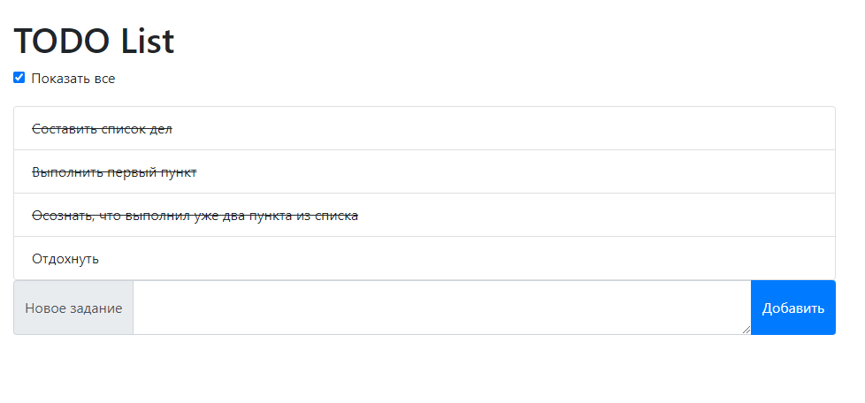
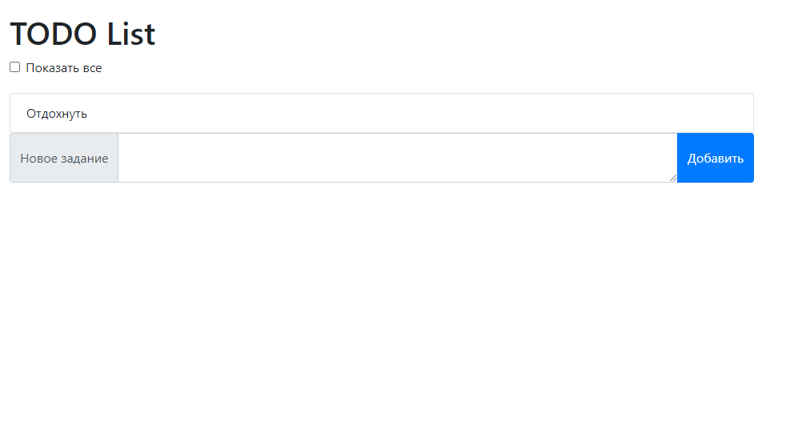

# job4j_todo

Проект Todo list является интерактивной реализацией списка дел.
Сервис позволяет добавлять новые задачи в список, а так же отмечать уже выполенные задачи.

Список использованных технологий:
- Java 11, Maven, Junit 4
- Servlet API
- Postgresql, JDBC 
- HTML, CSS, JavaScript (ES6), Bootstrap 4 

